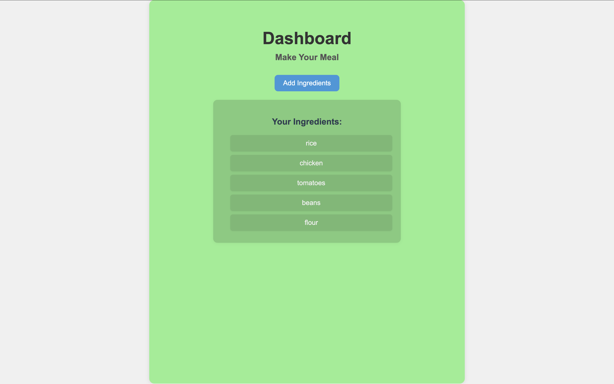

# Recipe Finder

**Recipe Finder** is a web app that helps you discover recipes you can make using the ingredients you already have. Powered by the Spoonacular API, it suggests real meals and shows what you're missing to complete each dish — no guessing, no waste.

---

## Features

-  Add ingredients from your kitchen
-  Discover real recipes that match
-  See what ingredients you're missing per recipe
-  Expand/collapse long instructions with “Show More”
-  Clean, mobile-friendly interface
-  Highlights missing ingredients

---

##  Screenshots




---

##  Built With

- **Flask** (Python backend)
- **Jinja2** (HTML templating)
- **HTML / CSS / JavaScript**
- **Spoonacular API**

---

###  Installation

```bash
git clone https://github.com/Asish0001/whats-in-my-kitchen.git
cd whats-in-my-kitchen
pip install flask requests python-dotenv
